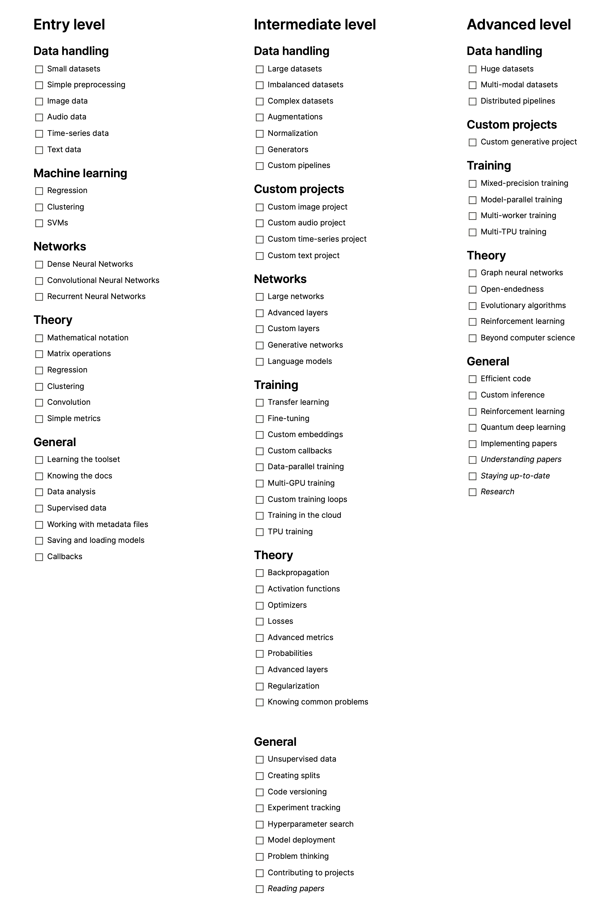

# A checklist to track your ML progress

This checklist provides an outline of the field, divided into three broad levels: Entry level, intermediate level, and advanced level. It does not list specific courses or software, but focuses on the general concepts.

A detailed description is available at [this Towards Data Science post](https://towardsdatascience.com/a-checklist-to-track-your-machine-learning-progress-801405f5cf86), and the list is available on Notion [here](https://www.notion.so/A-checklist-to-track-your-Machine-Learning-progress-e6b4501e99e54cdf93131e0e7bfd6ecf).

